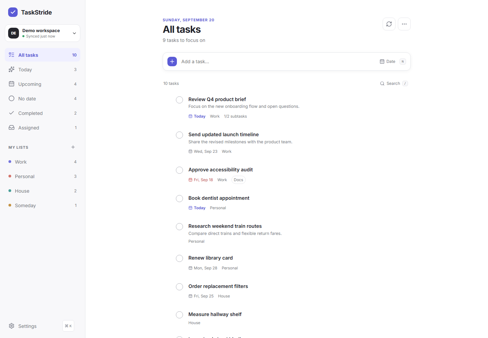
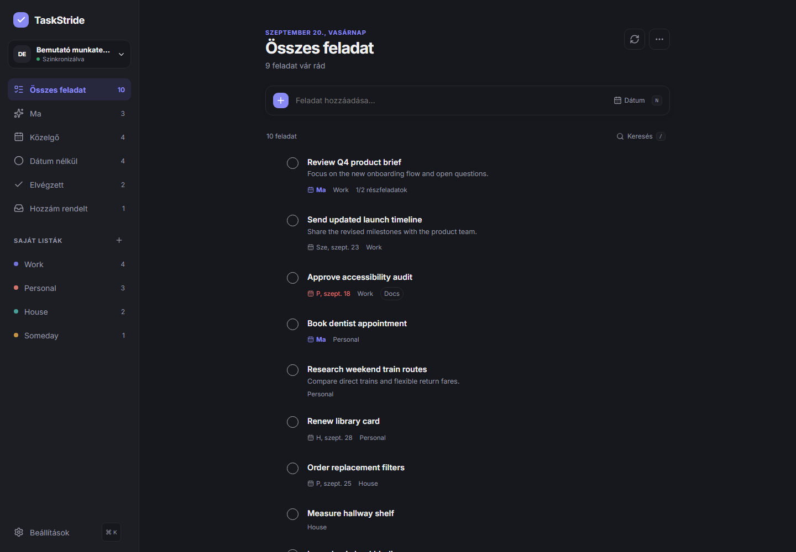
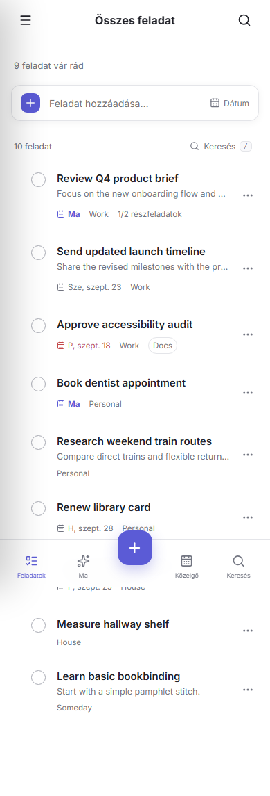

# TaskStride

TaskStride is a responsive, installable frontend for Google Tasks. It talks directly from the browser to Google Identity Services and the official Google Tasks REST API. There is no proprietary task database or second account system; the only server-side code is the optional authorization backend in `functions/`, which keeps a Google session alive for longer than an hour.

## Screenshots

### Desktop





### Mobile (Hungarian)



## Features

- All tasks is the default, top navigation view, with Today, Upcoming, No date, Completed, and Assigned views available below it.
- Fast task creation, completion, editing, deletion with Undo, date-only due dates, notes, subtasks, manual ordering, and cross-list movement.
- Manual ordering by dragging a row anywhere on its surface: a mouse starts a drag after a few pixels of travel, touch after a short hold so swiping still scrolls, and a keyboard activator on each row covers assistive technology.
- On phones the task composer is summoned by the add button in the bottom bar instead of permanently occupying the top of the list.
- Typed Google Tasks adapter with pagination, PATCH updates, task/list CRUD, move semantics, clear-completed support, and friendly API errors.
- Google Identity Services with an optional authorization backend. Deployed with `functions/`, the refresh token stays in a sealed HttpOnly cookie and sessions survive reloads, new tabs and days away; without it, the in-tab token flow is used and a reconnect is needed roughly every hour.
- Responsive three-pane desktop, tablet sheet, and dedicated mobile navigation.
- Instant local search, command menu, keyboard shortcuts, dark mode, comfortable/compact density, and list-specific task counts.
- JSON export and a merging import: importing only creates the tasks that are missing. A task is skipped when its id already exists, or when the destination list already holds a task with the same title and the same due date. Missing lists are created, subtasks are reattached to their parent, and completed tasks are imported as completed.
- Complete English and Hungarian interface selectable in Settings; the preference is stored locally.
- IndexedDB cache for read-only offline browsing; offline writes are intentionally disabled in this release.
- PWA manifest, service worker, install icons, cached app shell, and update-ready configuration.
- Accessible labels, visible focus styles, reduced-motion support, keyboard alternatives, and 44 px mobile targets.
- Development mock mode that uses the same repository interface as Google Tasks.

## Architecture

```text
React UI
  ├─ TanStack Query (remote state and optimistic updates)
  ├─ Zustand (small persistent UI preferences)
  ├─ Dexie / IndexedDB (cached task snapshot)
  └─ TaskRepository
       ├─ MockTasksRepository
       └─ GoogleTasksRepository → Google Tasks REST API

Browser → Google Identity Services → Google Tasks API
```

Google task IDs are canonical. Smart views are derived locally and never create duplicate tasks. List accent colors and appearance preferences are local-only.

## Prerequisites

- Node.js 22 or newer
- npm 10 or newer
- An HTTPS origin for production OAuth (localhost is supported for development)
- A Google Cloud project when using real data

## Local development

```bash
cp .env.example .env.local
npm install
npm run dev
```

Mock mode is enabled with `VITE_MOCK_MODE=true`. It includes Work, Personal, House, and Someday lists with normal, nested, completed, overdue, assigned-style, dated, and undated tasks.

## Google Cloud and OAuth setup

1. Open Google Cloud Console and select or create a project.
2. In **APIs & Services → Library**, enable **Google Tasks API**.
3. Configure the OAuth consent screen. Add the minimal `https://www.googleapis.com/auth/tasks` scope, your app information, and test users while the app is in testing.
4. In **APIs & Services → Credentials**, create an **OAuth client ID** of type **Web application**.
5. Add every development and production origin under **Authorized JavaScript origins**, for example `http://localhost:5173` and `https://tasks.example.com`. Origins do not include a path.
6. Copy the client ID—not a client secret—into `.env.local`:

```dotenv
VITE_GOOGLE_CLIENT_ID=1234567890-example.apps.googleusercontent.com
VITE_MOCK_MODE=false
```

TaskStride runs in either of two authorization modes and picks one automatically at startup by
probing `POST /api/token`.

**Authorization backend (recommended).** The `functions/` directory is a Cloudflare Pages
Functions backend that exchanges the Google auth code server-side, seals the refresh token into
an `HttpOnly; Secure; SameSite=Lax` cookie with AES-GCM, and hands the browser only short-lived
access tokens. The app renews them five minutes before expiry, when the tab becomes visible and
after any 401 from Google, so a session lasts as long as Google keeps the grant. See
[docs/cloudflare-setup.md](docs/cloudflare-setup.md); the Google consent screen must be
published **In production**, or Google expires refresh tokens after seven days.

**No backend.** When the endpoints are absent or unconfigured, TaskStride falls back to the
browser token model. Access tokens live one hour, are kept in session storage so reloads stay
connected, and cannot be refreshed silently: cached tasks stay visible read-only and the user
reconnects by hand.

## Configuration

| Variable | Purpose | Default |
| --- | --- | --- |
| `VITE_GOOGLE_CLIENT_ID` | Google Web OAuth client ID, read at build time | unset |
| `VITE_AUTH_API_BASE` | Base path of the authorization backend | `/api` |
| `VITE_MOCK_MODE` | Use realistic local demo data | enabled when no client ID is present |
| `VITE_APP_NAME` | App/manifest display name | `TaskStride` |
| `VITE_APP_BASE_PATH` | Deployment base, e.g. `/tasks/` | `/` |
| `VITE_SOURCE_URL` | Open-source repository URL | unset |

Never put a Google client secret in any `VITE_` variable. Vite exposes these variables to the browser.

The authorization backend reads its own runtime variables, which are **not** prefixed and are
never exposed to the browser: `GOOGLE_CLIENT_ID`, `GOOGLE_CLIENT_SECRET` and `SESSION_SECRET`.
See [docs/cloudflare-setup.md](docs/cloudflare-setup.md).

## Commands

```bash
npm run dev          # development server
npm run build        # strict TypeScript and production build
npm run preview      # preview the production build
npm run test         # unit and component tests
npm run test:e2e     # Playwright critical flows
npm run lint         # ESLint
npm run typecheck    # strict TypeScript only
```

## Static production deployment

```bash
npm install
npm run build
```

Publish the generated `dist/` directory on any HTTPS static host. For a subpath, build with `VITE_APP_BASE_PATH=/tasks/` and serve the SPA fallback from the same path.

### Cloudflare Pages

Build with `npm run build`, publish `dist/`, and Pages deploys `functions/` alongside it.
`public/_headers` carries the Content-Security-Policy and cache headers, and
`public/_routes.json` keeps the worker off the static asset paths. Configuring the three
backend variables enables long-lived sessions; leaving them out keeps the deployment static.
Full walkthrough: [docs/cloudflare-setup.md](docs/cloudflare-setup.md).

### nginx

```nginx
location /tasks/ {
    alias /var/www/taskstride/;
    try_files $uri $uri/ /tasks/index.html;
    add_header Content-Security-Policy "default-src 'self'; script-src 'self' https://accounts.google.com; connect-src 'self' https://tasks.googleapis.com https://oauth2.googleapis.com; frame-src https://accounts.google.com; img-src 'self' data:; style-src 'self' 'unsafe-inline'; base-uri 'self'; object-src 'none'; frame-ancestors 'self'" always;
}
```

### Apache

```apache
RewriteEngine On
RewriteBase /tasks/
RewriteCond %{REQUEST_FILENAME} !-f
RewriteCond %{REQUEST_FILENAME} !-d
RewriteRule . /tasks/index.html [L]

Header always set Content-Security-Policy "default-src 'self'; script-src 'self' https://accounts.google.com; connect-src 'self' https://tasks.googleapis.com https://oauth2.googleapis.com; frame-src https://accounts.google.com; img-src 'self' data:; style-src 'self' 'unsafe-inline'; base-uri 'self'; object-src 'none'"
```

Use content-hashed cache headers for `assets/`, but serve `index.html`, `manifest.webmanifest`, and `sw.js` with revalidation so PWA updates are discovered. Do not force a page reload while a user is editing.

## Privacy and security

- With the authorization backend, the refresh token is encrypted and stored in an HttpOnly cookie that page scripts cannot read, and the access token exists only in JavaScript memory.
- Without a backend, the access token is kept in session storage for the lifetime of the tab. It is never written to localStorage, cookies, or IndexedDB.
- Client secrets live only in Cloudflare secrets. They are never placed in a `VITE_` variable, which Vite would inline into the browser bundle.
- Task contents are cached in IndexedDB on the current device for offline browsing.
- localStorage contains only UI preferences such as theme, density, selected view, and favorites.
- **Clear local cache** deletes the IndexedDB task snapshot. **Disconnect Google** also clears cached task data.
- No telemetry is included.
- External links open with `noopener,noreferrer`; API data is rendered as text; `dangerouslySetInnerHTML` is not used.

## Google Tasks API limitations

- Due values contain a calendar date only. Google discards the time portion, so TaskStride never offers due times or reminders.
- Assigned and repeating tasks have move/nesting restrictions. TaskStride disables or rejects unsupported operations.
- Repeating rules can be returned but are not reliably writable through the Tasks API, so there is no recurrence editor.
- Google list colors do not exist in the Tasks data model; TaskStride accents are local preferences only.
- Cross-list movement of recurring tasks is not supported by Google.
- Browser access tokens expire after an hour and require a user-driven reconnect in a backend-free deployment; deploy `functions/` to avoid this.
- Offline task mutations are disabled until a robust conflict-aware queue can be provided.

## Troubleshooting

**OAuth popup closes or reports `origin_mismatch`**  
Confirm the exact protocol, host, and port are listed as an authorized JavaScript origin. Production must use HTTPS.

**Permission denied**  
Confirm the Tasks API is enabled, the consent screen includes the Tasks scope, and the signed-in account is an allowed test user while the app is in testing.

**Task lists are blank**  
Use Refresh, reconnect Google, then inspect the browser network panel for a 401 or 403 response. Verify `VITE_MOCK_MODE=false` and that the client ID belongs to the project where Tasks API is enabled.

**Deployed under a subpath but assets 404**  
Set `VITE_APP_BASE_PATH` before building and configure the host's SPA fallback to that same base.

## License

MIT. See [LICENSE](LICENSE).
